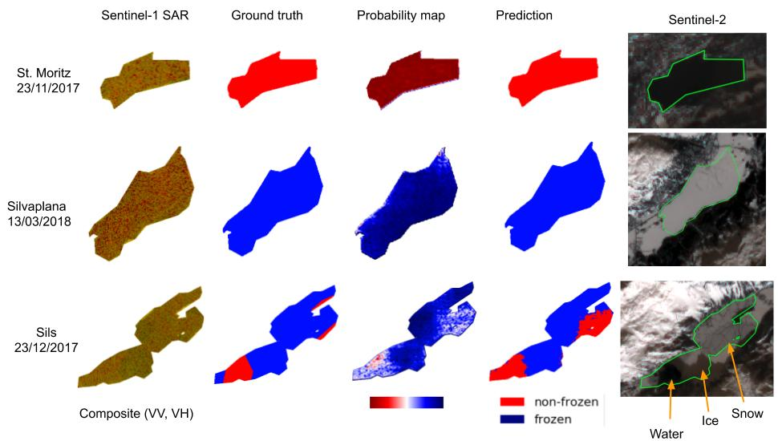
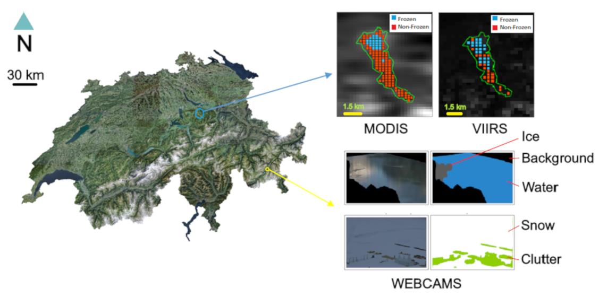
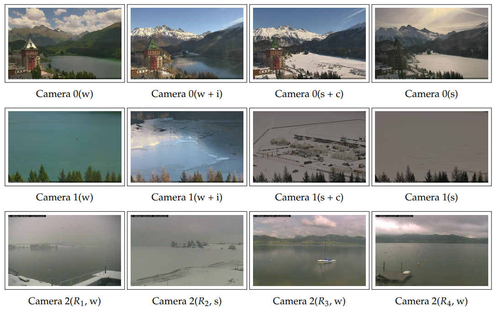
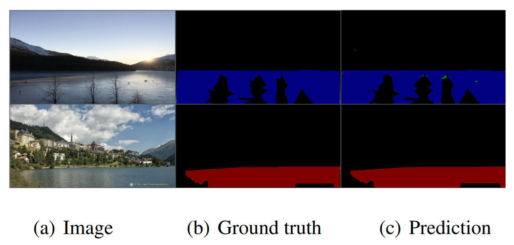
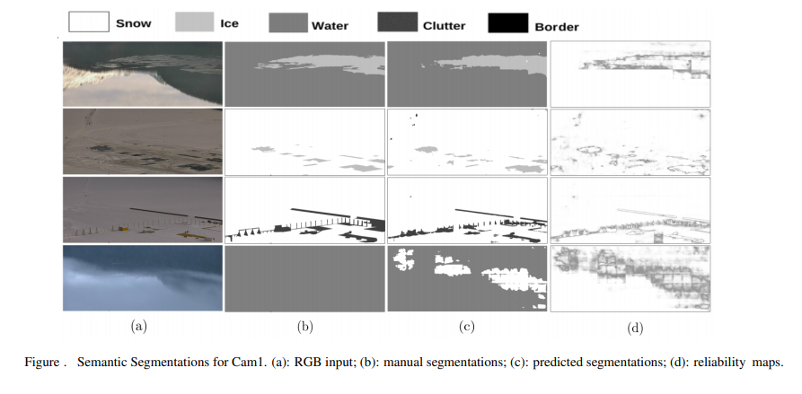
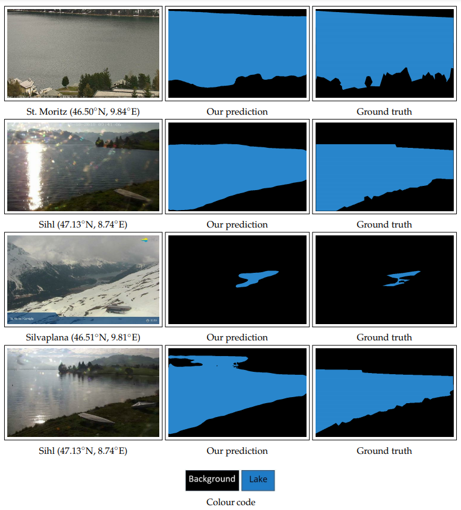

# Multi-Sensor Lake Ice Monitoring with Machine (Deep) Learning

This is a consolidated repository outlining our research works on lake ice monitoring using machine (deep) learning approaches. These works are part of the two projects ([LIP1](https://prs.igp.ethz.ch/research/completed_projects/integrated-monitoring-of-ice-in-selected-swiss-lakes.html), [LIP2](https://prs.igp.ethz.ch/research/current_projects/integrated-lake-ice-monitoring-and-generation-of-sustainable--re.html)) at ETH Zurich funded by [MeteoSwiss](https://www.meteoswiss.admin.ch/) under the [GCOS Switzerland](https://www.meteoswiss.admin.ch/home/research-and-cooperation/international-cooperation/gcos.html) framework.

## Contents

>[1. Lake Ice Detection from Sentinel-1 SAR with Deep Learning](#isprs_sar_2020) 
>[2. Ice Monitoring in Swiss Lakes from Optical Satellites and Webcams Using Machine Learning](#rs_mdpi_2020) 
>[3. Photi-LakeIce Webcam Dataset](#PLI_dataset) 
>[4. Recent Ice Trends in Swiss Mountain Lakes: 20-year Analysis of MODIS Imagery](#time_series) 
>[5. Learning a Sensor-invariant Embedding of Satellite Data: A Case Study for Lake Ice Monitoring](#satellite_embedding) 
>[6. Lake Ice Detection in Crowd-sourced images using Deep-U-Lab](#crowd_sourced) 
>[7. Lake Ice Monitoring with Webcams using Tiramisu Network](#tiramisu) 
>[8. Automatic Lake Detection using Deep-U-Lab](#tiramisu) 

## <a name="isprs_sar_2020">1. Lake Ice Detection from Sentinel-1 SAR with Deep Learning</a>

This work was presented at the [ISPRS Congress 2020](http://www.isprs2020-nice.com/index.php/virtualevent-2/).  Access the paper [here](https://www.isprs-ann-photogramm-remote-sens-spatial-inf-sci.net/V-3-2020/409/2020/).

We use the Sentinel-1 Synthetic Aperture Radar data downloaded from the [Google Earth Engine](https://developers.google.com/earth-engine/guides/sentinel1) platform to detect lake ice with the state-of-the-art semantic segmentation network Deeplab v3+. Here, we model lake ice detection as a 2-class (frozen, non-frozen) classification problem. 
Access the tensorflow-based repository [here](https://github.com/czarmanu/sentinel_lakeice) to browse the CNN code, pre-trained model etc.

Please cite the following paper if you use this project in your research:

> @article{tom_aguilar_2020:isprs, 
>&nbsp;&nbsp;&nbsp;&nbsp;&nbsp;&nbsp;author    = {Manu Tom and Roberto Aguilar and Pascal Imhof and Silvan Leinss and Emmanuel Baltsavias and Konrad Schindler}, 
> &nbsp;&nbsp;&nbsp;&nbsp;&nbsp;&nbsp;title     = {Lake Ice Detection from Sentinel-1 SAR with Deep Learning}, 
>&nbsp;&nbsp;&nbsp;&nbsp;&nbsp;&nbsp;journal   = {ISPRS Ann. Photogramm. Remote Sens. Spatial Inf. Sci.}, 
>&nbsp;&nbsp;&nbsp;&nbsp;&nbsp;&nbsp;year      = {2020}, 
>&nbsp;&nbsp;&nbsp;&nbsp;&nbsp;&nbsp;volume    = {V-3-2020}, 
>&nbsp;&nbsp;&nbsp;&nbsp;&nbsp;&nbsp;pages     = {409--416}, 
}

## <a name="rs_mdpi_2020">2. Ice Monitoring in Swiss Lakes from Optical Satellites and Webcams Using Machine Learning</a>

This work was published at the [MDPI Remote Sensing](https://www.mdpi.com/journal/remotesensing) journal. Access the paper [here](https://www.mdpi.com/2072-4292/12/21/3555).

We detect lake ice in MODIS and VIIRS optical satellite images using support vector machines aided by an automatic feature seclection by XGBoost. Here, we cast lake ice detection as a 2-class (frozen, non-frozen) classification problem. Additionally, we use the freely available (online) webcam data to monitor lake ice using Deep-U-Lab network. Access the tensorflow-based repository [here](https://github.com/czarmanu/deeplab-lakeice-webcams) to browse the Deep-U-Lab code, pre-trained model etc.

Kindly cite the following paper, if you use this project in your research:

> @article{tom_prabha_2020:isprs, 
>&nbsp;&nbsp;&nbsp;&nbsp;&nbsp;&nbsp;author    = {Manu Tom and Rajanie Prabha and Tianyu Wu and Emmanuel Baltsavias and Laura Leal-Taixe and Konrad Schindler}, 
> &nbsp;&nbsp;&nbsp;&nbsp;&nbsp;&nbsp;title     = {Ice Monitoring in Swiss Lakes from Optical Satellites and Webcams Using Machine Learning}, 
>&nbsp;&nbsp;&nbsp;&nbsp;&nbsp;&nbsp;journal   = {Remote Sens.}, 
>&nbsp;&nbsp;&nbsp;&nbsp;&nbsp;&nbsp;year      = {2020}, 
>&nbsp;&nbsp;&nbsp;&nbsp;&nbsp;&nbsp;volume    = {12}, 
>&nbsp;&nbsp;&nbsp;&nbsp;&nbsp;&nbsp;issue     = {21}, 
>&nbsp;&nbsp;&nbsp;&nbsp;&nbsp;&nbsp;pages     = {3555}, 
}
    

## <a name="PLI_dataset">3. Photi-LakeIce Webcam Dataset</a>

The dataset and pre-trained model (Deep-U-Lab) can be found [here](https://github.com/czarmanu/photi-lakeice-dataset).

Kindly cite the following paper, if you use this dataset in your research:

> @article{tom_prabha_2020:isprs, 
>&nbsp;&nbsp;&nbsp;&nbsp;&nbsp;&nbsp;author    = {Manu Tom and Rajanie Prabha and Tianyu Wu and Emmanuel Baltsavias and Laura Leal-Taixe and Konrad Schindler}, 
> &nbsp;&nbsp;&nbsp;&nbsp;&nbsp;&nbsp;title    = {Ice Monitoring in Swiss Lakes from Optical Satellites and Webcams Using Machine Learning}, 
>&nbsp;&nbsp;&nbsp;&nbsp;&nbsp;&nbsp;journal   = {Remote Sens.}, 
>&nbsp;&nbsp;&nbsp;&nbsp;&nbsp;&nbsp;year      = {2020}, 
>&nbsp;&nbsp;&nbsp;&nbsp;&nbsp;&nbsp;volume    = {12}, 
>&nbsp;&nbsp;&nbsp;&nbsp;&nbsp;&nbsp;issue     = {21}, 
>&nbsp;&nbsp;&nbsp;&nbsp;&nbsp;&nbsp;pages     = {3555}, 
}

## <a name="time_series">4. Recent Ice Trends in Swiss Mountain Lakes: 20-year Analysis of MODIS Imagery</a>

Access the preprint [here](https://arxiv.org/abs/2103.12434). 
Code coming soon.

Please cite the following paper, if you use this project in your research:

> @article{tom_wu_2021:arxiv, 
>&nbsp;&nbsp;&nbsp;&nbsp;&nbsp;&nbsp;author    = {Manu Tom and Tianyu Wu and Emmanuel Baltsavias and Konrad Schindler}, 
> &nbsp;&nbsp;&nbsp;&nbsp;&nbsp;&nbsp;title    = {Recent Ice Trends in Swiss Mountain Lakes: 20-year Analysis of MODIS Imagery}, 
>&nbsp;&nbsp;&nbsp;&nbsp;&nbsp;&nbsp;journal   = {arXiv pre-print, arXiv:2103.12434v1}, 
>&nbsp;&nbsp;&nbsp;&nbsp;&nbsp;&nbsp;year      = {2021}, 
>&nbsp;&nbsp;&nbsp;&nbsp;&nbsp;&nbsp;volume    = {}, 
>&nbsp;&nbsp;&nbsp;&nbsp;&nbsp;&nbsp;pages     = {}, 
}

## <a name="satellite_embedding">5. Learning a Sensor-invariant Embedding of Satellite Data: A Case Study for Lake Ice Monitoring</a>

Access the preprint [here](https://arxiv.org/abs/2107.09092). Code will be published soon.

Please cite the following paper, if you use this project in your research:

> @article{tom_jiang_2021:arxiv, 
>&nbsp;&nbsp;&nbsp;&nbsp;&nbsp;&nbsp;author    = {Manu Tom and Yuchang Jiang and Emmanuel Baltsavias and Konrad Schindler}, 
> &nbsp;&nbsp;&nbsp;&nbsp;&nbsp;&nbsp;title    = {Learning a Sensor-invariant Embedding of Satellite Data: A Case Study for Lake Ice Monitoring}, 
>&nbsp;&nbsp;&nbsp;&nbsp;&nbsp;&nbsp;journal   = {arXiv pre-print, arXiv:2107.09092v1}, 
>&nbsp;&nbsp;&nbsp;&nbsp;&nbsp;&nbsp;year      = {2021}, 
>&nbsp;&nbsp;&nbsp;&nbsp;&nbsp;&nbsp;volume    = {}, 
>&nbsp;&nbsp;&nbsp;&nbsp;&nbsp;&nbsp;pages     = {}, 
}

## <a name="crowd_sourced">6. Lake Ice Detection in Crowd-sourced images using Deep-U-Lab</a>

More details [here](https://github.com/czarmanu/deeplab-lakeice-webcams).

Kindly cite the following paper, if you use this research in your work:

> @article{prabha_tom_2020:isprs, 
>&nbsp;&nbsp;&nbsp;&nbsp;&nbsp;&nbsp;author    = {Rajanie Prabha and Manu Tom and Mathias Rothermel and Emmanuel Baltsavias and Laura Leal-Taixe and Konrad Schindler}, 
> &nbsp;&nbsp;&nbsp;&nbsp;&nbsp;&nbsp;title    = {Lake Ice Monitoring with Webcams and Crowd-Sourced Images}, 
>&nbsp;&nbsp;&nbsp;&nbsp;&nbsp;&nbsp;journal   = {ISPRS Ann. Photogramm. Remote Sens. Spatial Inf. Sci.}, 
>&nbsp;&nbsp;&nbsp;&nbsp;&nbsp;&nbsp;year      = {2020}, 
>&nbsp;&nbsp;&nbsp;&nbsp;&nbsp;&nbsp;volume    = {V-2-2020}, 
>&nbsp;&nbsp;&nbsp;&nbsp;&nbsp;&nbsp;pages     = {549--556}, 
}

## <a name="tiramisu">7. Lake Ice Monitoring with Webcams using Tiramisu Network</a>

More details [here](https://github.com/czarmanu/tiramisu_keras).

Please cite the following paper, if you use this project in your research:

> @article{xiao_rothermel_2018:isprs, 
>&nbsp;&nbsp;&nbsp;&nbsp;&nbsp;&nbsp;author    = {Muyan Xiao and Mathias Rothermel and Manu Tom and Silvano Galliani and Emmanuel Baltsavias and Konrad Schindler}, 
> &nbsp;&nbsp;&nbsp;&nbsp;&nbsp;&nbsp;title    = {Lake Ice Monitoring with Webcams}, 
>&nbsp;&nbsp;&nbsp;&nbsp;&nbsp;&nbsp;journal   = {ISPRS Ann. Photogramm. Remote Sens. Spatial Inf. Sci.}, 
>&nbsp;&nbsp;&nbsp;&nbsp;&nbsp;&nbsp;year      = {2018}, 
>&nbsp;&nbsp;&nbsp;&nbsp;&nbsp;&nbsp;volume    = {IV-2}, 
>&nbsp;&nbsp;&nbsp;&nbsp;&nbsp;&nbsp;pages     = {311--317}, 
}

## 8. Automatic Lake Detection using Deep-U-Lab

Details coming soon ...

## Other related publications

>1. Tom, M., Suetterlin, M., Bouffard, D., Rothermel, M., Wunderle, S., and Baltsavias, E.: [Integrated monitoring of ice in selected Swiss lakes](https://arxiv.org/abs/2008.00512). Final Project Report, 2020.

>2. Tom, M., Kälin, U., Sütterlin, M., Baltsavias, E., and Schindler, K.: [Lake ice detection in low-resolution optical satellite images](https://www.isprs-ann-photogramm-remote-sens-spatial-inf-sci.net/IV-2/279/2018/), ISPRS Ann. Photogramm. Remote Sens. Spatial Inf. Sci., IV-2, 279–286, https://doi.org/10.5194/isprs-annals-IV-2-279-2018, 2018.

>3. Rothermel, M., Xiao, M., Tom, M., Baltsavias, E., and Schindler, K. : [Monitoring der vereisung von Schweizer seen mit webcams](https://ethz.ch/content/dam/ethz/special-interest/baug/igp/photogrammetry-remote-sensing-dam/documents/pdf/Papers/Webcams_Geomatik_9-2018.pdf), Geomatik Schweiz, 9/2018, 268--271, 2018.

>4. Tom, M., Sütterlin, M., Bouffard, D., Rothermel, M., Hamann, U., Duguay-Tetzlaff, A., Wunderle, S., Baltsavias, E.: [Integrated lake ice monitoring in Swiss lakes](https://ethz.ch/content/dam/ethz/special-interest/baug/igp/photogrammetry-remote-sensing-dam/documents/pdf/Papers/Tom_Eumetsat2018.pdf), EUMETSAT - Meteorological Satellite Conference, Tallinn, Estonia, 17-21 September 2018.

>5. Tom M., Lanaras, C., Baltsavias, E., and Schindler, K.: [Ice detection in Swiss lakes using MODIS data](https://www.research-collection.ethz.ch/bitstream/handle/20.500.11850/236400/1/Tom_ETHZ_ACRS17.pdf), In Proceedings of the Asian Conference on Remote Sensing, New Delhi, India, 23–27 October 2017.

## Licence

MIT License

Copyright (c) 2020 ETH Zurich

Permission is hereby granted, free of charge, to any person obtaining a copy of this software and associated documentation files (the "Software"), to deal
in the Software without restriction, including without limitation the rights to use, copy, modify, merge, publish, distribute, sublicense, and/or sell
copies of the Software, and to permit persons to whom the Software is furnished to do so, subject to the following conditions:

The above copyright notice and this permission notice shall be included in all copies or substantial portions of the Software.

THE SOFTWARE IS PROVIDED "AS IS", WITHOUT WARRANTY OF ANY KIND, EXPRESS OR IMPLIED, INCLUDING BUT NOT LIMITED TO THE WARRANTIES OF MERCHANTABILITY,
FITNESS FOR A PARTICULAR PURPOSE AND NONINFRINGEMENT. IN NO EVENT SHALL THE AUTHORS OR COPYRIGHT HOLDERS BE LIABLE FOR ANY CLAIM, DAMAGES OR OTHER
LIABILITY, WHETHER IN AN ACTION OF CONTRACT, TORT OR OTHERWISE, ARISING FROM, OUT OF OR IN CONNECTION WITH THE SOFTWARE OR THE USE OR OTHER DEALINGS IN THE
SOFTWARE.

Author: Manu Tom
